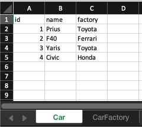
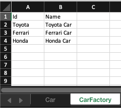

# ExcelDB

A very simple ORM library for Excel XLSX files.

### Key Features

- Read data from Excel worksheets
- Write data to Excel worksheets
- Nested data supported

## Installation

### Installation

#### Gradle

In your gradle build file add the following:

Kotlin DSL
```kotlin
repositories {
    mavenCentral()
}

dependencies {
    implementation("")
}
```

Groovy DSL
```groovy
repositories {
    mavenCentral()
}

dependencies {
    implementation ''
}
```

#### Maven

In your `pom.xml` file make sure you have the following in your `repositories`:
```xml
<repository>
    <id>mavenCentral</id>
    <url>https://repo1.maven.org/maven2/</url>
</repository>
```

Then add the following to your `dependencies`:
```xml
<dependency>
    <groupId></groupId>
    <artifactId></artifactId>
    <version></version>
</dependency>
```
### Sample
```kotlin
data class Car(val id: Int, val name: String, val factory: CarFactory) : Entity
data class CarFactory(val id: String, val name: String) : Entity
```
These classes are mapped to worksheets as these pictures shows

 
